## 简介
GPT-Boss-Client是基于GPT-Boss平台的一个开源镜像站。GPTBoss平台是打通OpenAI的一站式GPT应用解决方案，接入OpenAI并拥有超细力度的用户体系，满足站长的日常运维。提供可视化界面，支持一键式部署、模型一键启停、部署，支持多种数配置方案，无需编写任何代码。基于分布式架构，支持多机多卡调度、多种混合调度，支持多种推理引擎，支持多种部署方式。

您只需要注册一个管理员账号(站长账号)，即可通过GPT-Boss平台搭建你的GPT镜像，无需编写任何代码。

## 注册站长账号
首先，您需要注册一个站长账号，这个账号将作为您的管理员账号，您可以通过这个账号来管理您的GPT镜像。 登录[注册页面](https://boss.icoding.ink/manager/#/register)，填写您的邮箱、用户名、密码，点击注册即可。

注册成功后，请牢记您的账号密码，该账号将作为您的管理员账号，您可以通过这个账号来管理您的所有GPT镜像。
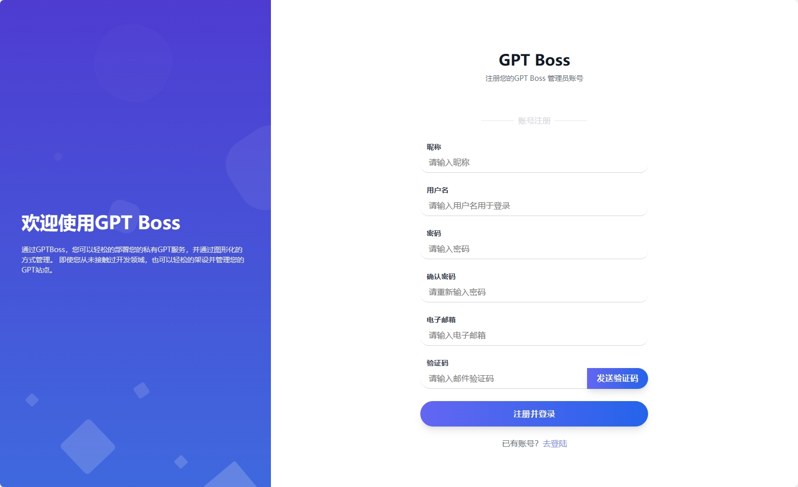

## 部署GPT镜像
我们提供了多种部署方式，您可以根据您的需求选择不同的部署方式。同时，我们的镜像站是开源的，您可以根据您的需求自行修改。

源码地址：[https://github.com/onlyGuo/chatgpt-private-client](https://github.com/onlyGuo/chatgpt-private-client)

- 基于Docker部署

我们提供了Docker镜像，您可以通过Docker部署您的GPT镜像。您只需要在您的服务器上安装Docker，然后运行我们的镜像即可。

```bash
docker run -d -p 8080:8080 \
 -v /home/chatgpt/logs:/home/apps/logs \
 -v /home/chatgpt/data:/home/apps/data \
 --name chatgpt guoshengkai/gpt-boss-cc:latest
```
- 原生部署

我们提供了原生部署的方式，您可以通过原生部署的方式部署您的GPT镜像。您只需要在您的服务器上安装JDK17，然后运行我们的镜像即可。
1. 克隆代码
```bash
git clone https://github.com/onlyGuo/GPT-Boss-Client.git
```
2. 编译代码

   编译代码需要安装Maven，然后运行以下命令即可。编译成功后，会在target目录下生成一个xxx.jar文件。
```bash
mvn clean package -Dmaven.test.skip=true
```
3. 运行代码
```bash
java -jar xxx.jar
```

- 基于Vercel部署

`待补充`

## 初始化GPT镜像
部署成功后，您需要初始化您的GPT镜像，初始化的目的是为了让您的GPT镜像能够正常工作。您只需要在浏览器中输入您的GPT镜像的地址，然后按照提示进行初始化即可。

### 访问安装页面
首次访问GPT镜像时，会自动跳转到安装页面（`http(s)://yourdoman/#/install`），安装页面会对您披露一个管理员密钥，这个密钥就是管理您网站的唯一标识，请妥善保管。
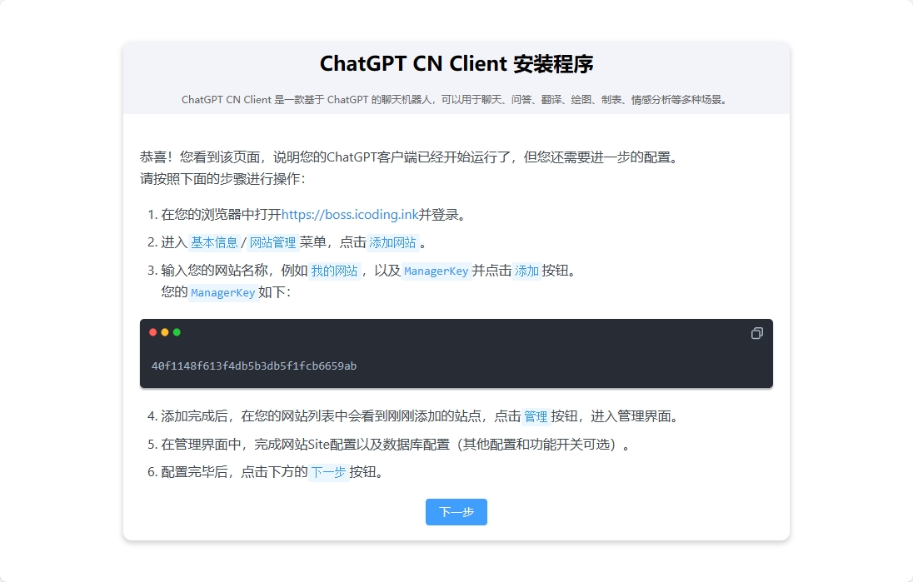

### 新建网站
1. 复制管理员密钥，然后再GPT Boss平台中登录刚刚注册的管理员账号。登录成功后，如果您的账号没有创建过任何GPT镜像，那么会自动引导你完成创建。
   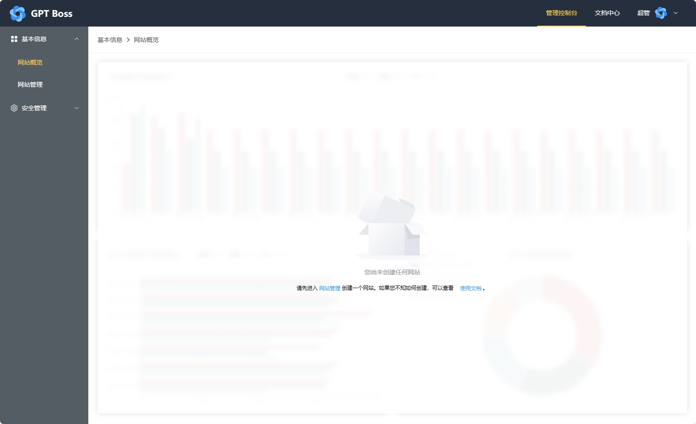
2. 点击”网站管理“创建您的第一个GPT镜像，输入您的管理员密钥，然后点击”创建“即可。
   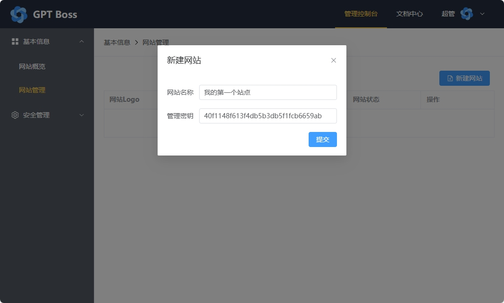
3. 网站创建成功后，你会看到一个网站列表，并且它的状态是`待初始化`
   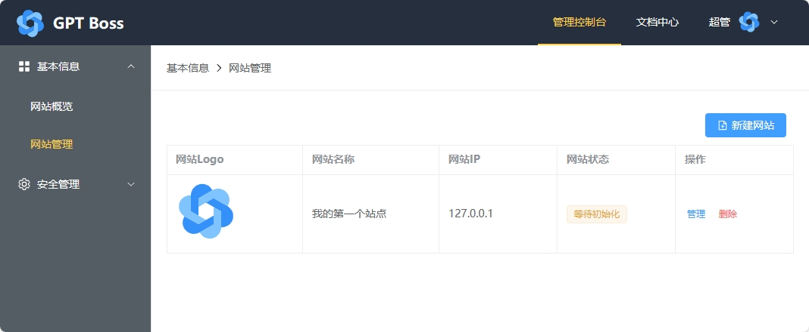
4. 点击您的网站旁边的`管理`按钮即可进入您的GPT镜像管理页面。您可以进一步配置您的GPT镜像。例如logo、名称、备案号等。
   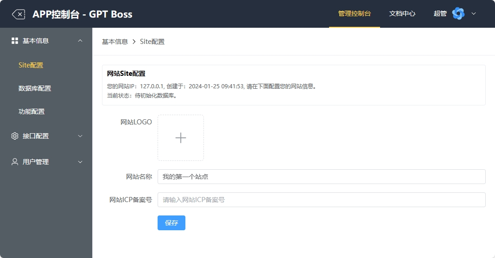
5. 进入`数据库管理`菜单，配置您的数据库信息，当前仅支持Mysql8，请确保您输入的MySQL地址能够被您的GPT镜像访问到。
   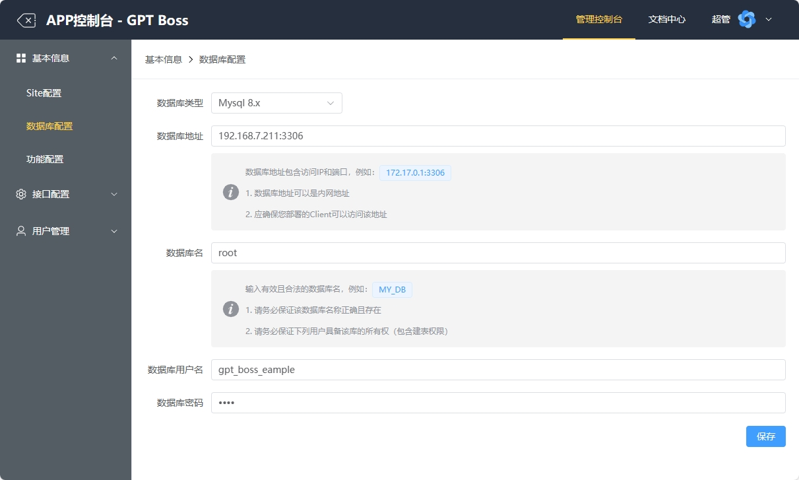
6. 回到您的GPT镜像的安装页面，点击`下一步`按钮，准备初始化数据库。
   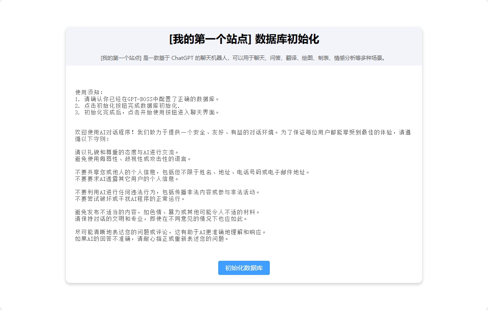
7. 点击`初始化数据库`按钮，等待初始化完成。完成后，点击`完成`至此安装完毕。
   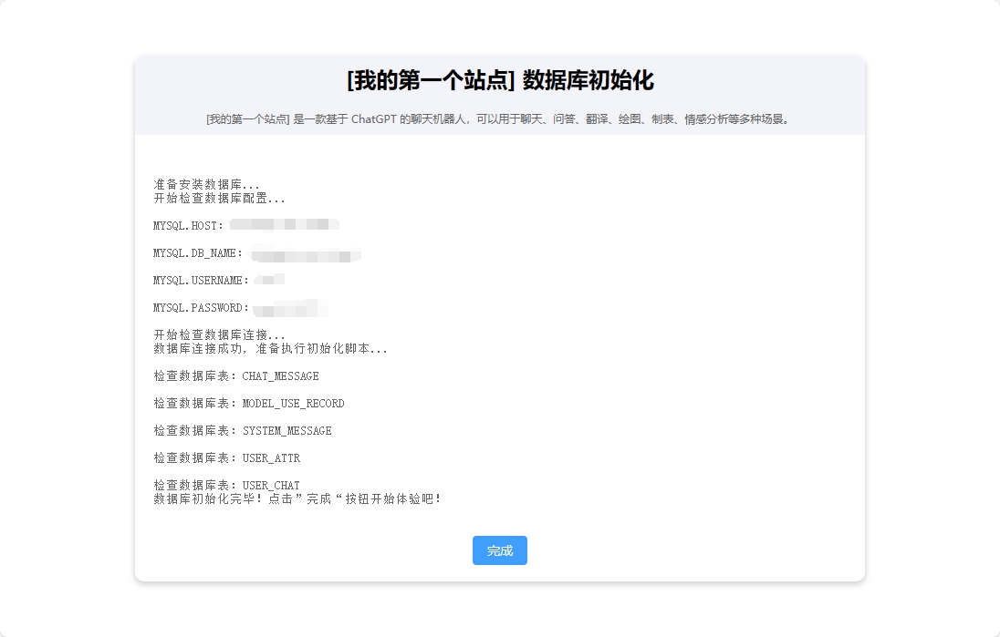

### 开启功能
1. 进入`功能配置`菜单，开启游客聊天功能，开启后，您的GPT镜像就可以提供游客聊天功能了。
   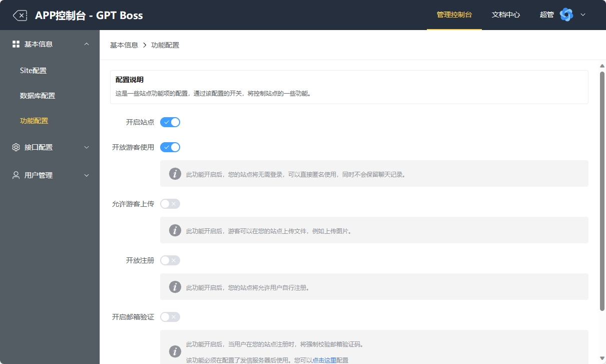
2. 进入`ChatGPT接口配置`菜单，配置您的GPT接口，您可以看大当前以支持的模型，系统倍率=0的模型就是当前可免费使用的模型，随便开启两个，如下图所示：
   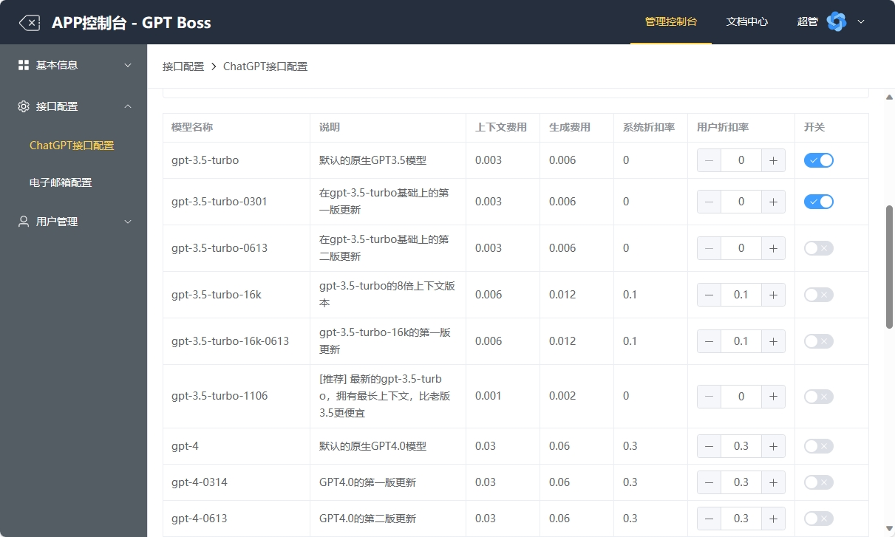

### 开始使用
回到我们的镜像站，您就可以开始使用您的GPT镜像了。点击左侧默认的聊天会话，即可开始聊天。
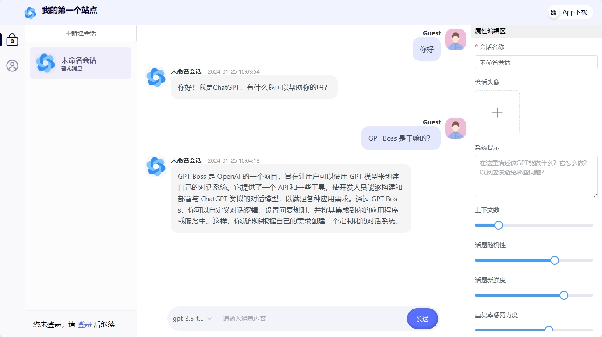